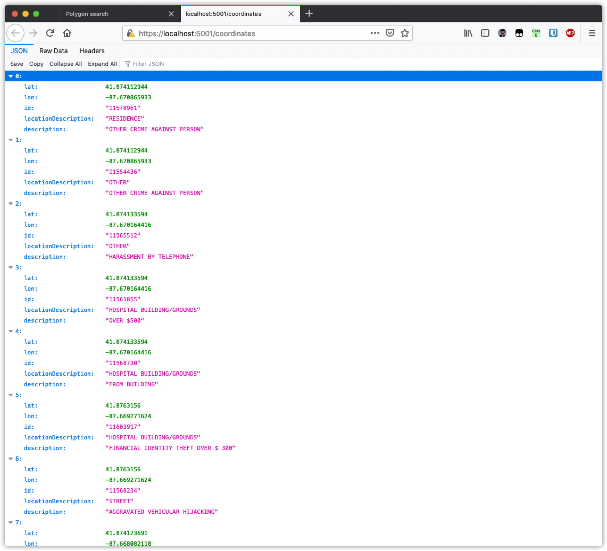
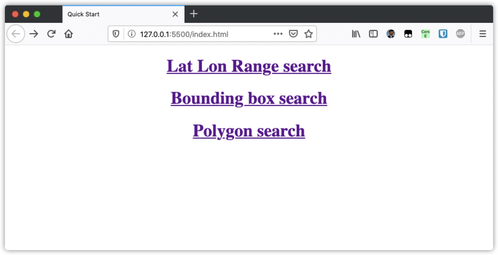
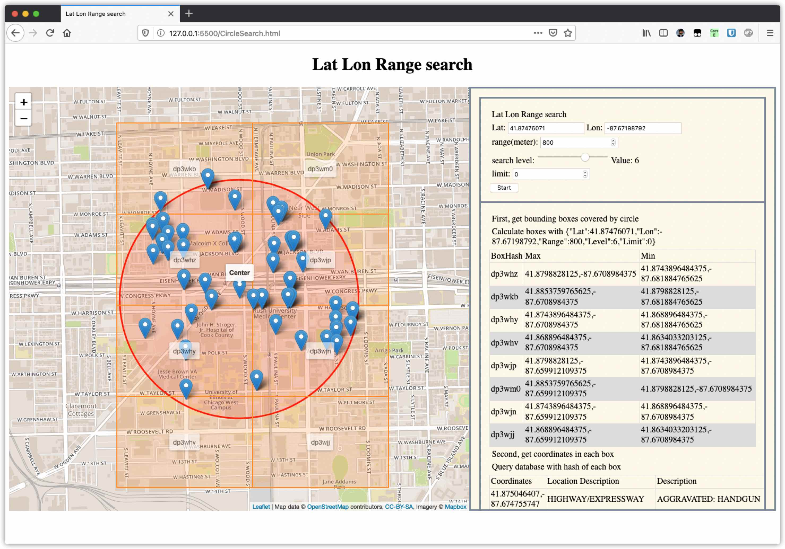
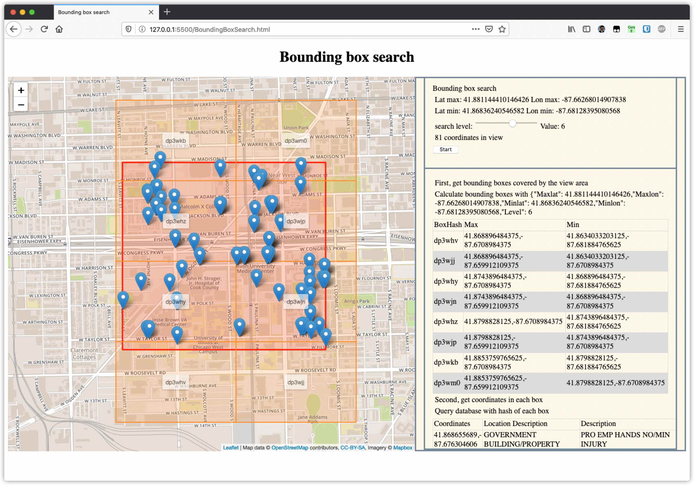
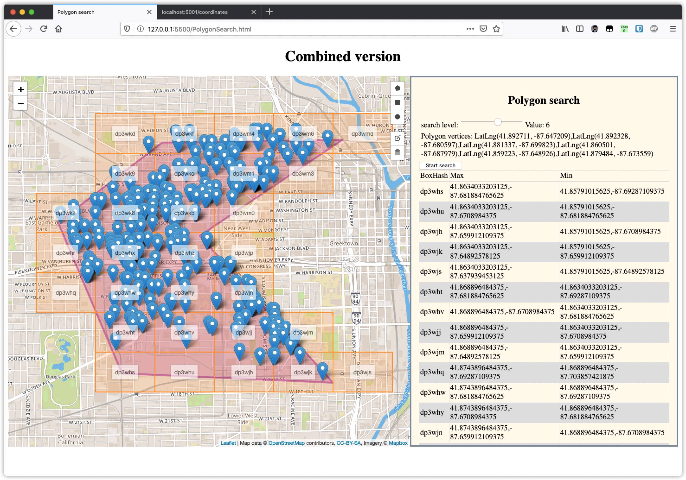

# Ajaxmap

A web front end that use for demo. It request data from server and display the search process on web page interactively.

### How to start

1. Setup the server backend

   Use Visual Studio to open the [server project](../server), open [DatabaseInterface.cs](../server/DatabaseInterface.cs),  check function AddDataset1, the path variable is correct. It should be the example data file called [Crimes_-_2019.csv](../server/Resources/Crimes_-_2019.csv) in Resources folder.

   Then run the server backend. It will take about 30 seconds for loading dataset1 depends on the computer speed.

   After the server backend started, it should show you this:

   

2. To open the demo page need to allow Cross-Origin Resource Sharing (CORS). One solution is to install an extension in your browser. For Firefox, you can install: [CORS Everywhere](https://addons.mozilla.org/en-US/firefox/addon/cors-everywhere/). For Chrome, you can install: [Allow CORS](https://chrome.google.com/webstore/detail/allow-cors-access-control/lhobafahddgcelffkeicbaginigeejlf?hl=en). Enable it.

3. Then start the webpage.

   Use [VS code](https://code.visualstudio.com/), install [Live Server](https://marketplace.visualstudio.com/items?itemName=ritwickdey.LiveServer) extension to run the webpage locally. Other development tools such as [WebStorm](https://www.jetbrains.com/webstorm/) also works.

   

### Lat Lon Range Search

Search coordinates in a certain circle.

The circle is defined with latitude, longitude and range(radius).

### Bounding box search

Search coordinates in a certain bounding box.

The bounding box is defined with current viewing area.

### Polygon Search (Combined Version)

It combines all three type of search.

Polygon search is searching coordinates in a certain polygon shape.

Start a search by click on the upper right icons then click on the map to define vertices.

### Reference

- [Leaflet](https://github.com/Leaflet/Leaflet)
- [Leaflet.draw](https://github.com/Leaflet/Leaflet.draw)
- [Mapbox](https://www.mapbox.com/)

